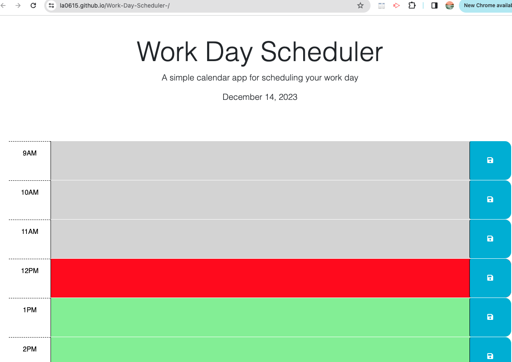

Work Day Scheduler 

## A scheduler for the workday 

This scheduler runs from 9am to 5pm and the user is able to type text to record what they have going on at each hour. The user can also save their text using the save button. Past events will be grayed out, present events will be in red, and future events will be showin in green to help the user differenciate times and plan accordingly .

## Installation

N/A

## Usage

